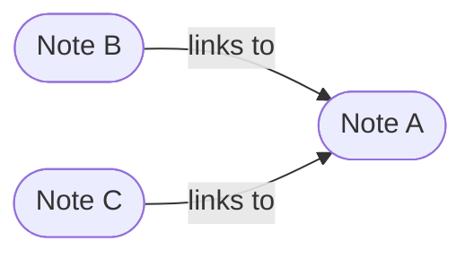
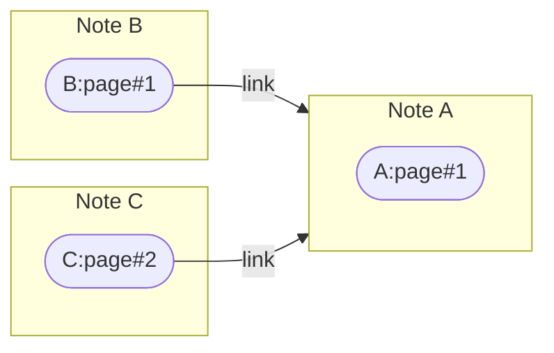
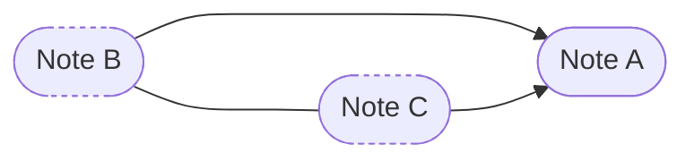
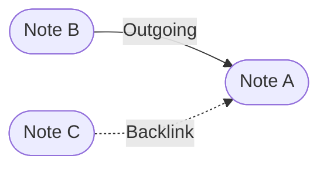

# Linking Relationship Graphs (Mermaid)

링크의 방향성(Outgoing/Backlink)과 코시테이션(공통 타깃 기반 연관)을 간단한 그래프로 예시합니다.

## 1) 기본 링크 방향 (노트 레벨)

## 2) 페이지 레벨 링크 + 노트 페이지 소속

## 3) 코시테이션(공통 타깃 기반 연관)

## 4) 아웃고잉 vs 백링크 하이라이트

설명
- 그래프 레벨은 노트/페이지 중 선택 가능합니다(옵션 토글).
- 코시테이션은 동일 타깃을 가리키는 노트들 사이의 유도 관계입니다(분석/추천/그래프 가중치에 활용).
- 실제 구현에서는 Providers로 링크/백링크/코시테이션을 파생 계산하여 그래프 데이터로 변환합니다.

